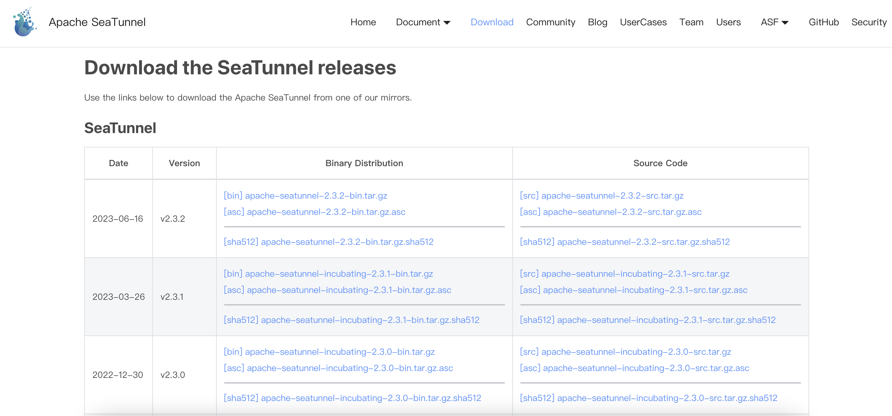
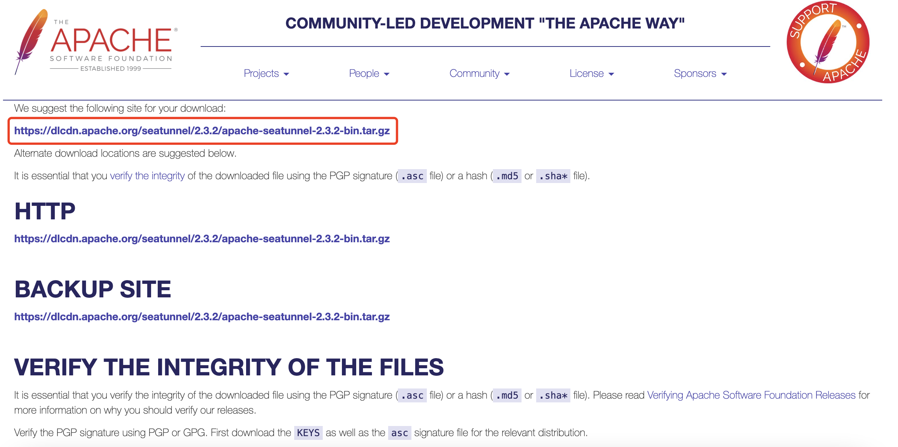

#### SeaTunnel
中文文档
##### 唠一唠
SeaTunnel国人主导的第一个Apache顶级项目，雄起。

业余尝鲜少不了，在体验过程中免不了要查看官方文档，以便更好的理解如何使用。实际情况是官方文档关于Source、Sink、Tranform的使用更多的只是罗列了全部参数，但是大量参数没有给出使用案例，全靠猜测，费时费力。

程序员为效率而生，特将自己学习过程中踩过的坑记录下来，方便后来者可以快速掌握。

##### SeaTunnel官网
[https://seatunnel.apache.org](https://seatunnel.apache.org)

##### SeaTunnel英文文档
V2.3.2（其它版本可以进入该页面后切换）

[https://seatunnel.apache.org/docs/2.3.2/about](https://seatunnel.apache.org/docs/2.3.2/about)

##### SeaTunnel下载地址
[https://seatunnel.apache.org/download](https://seatunnel.apache.org/download)

下载页面如下，可以选择合适的版本进行下载：

>需要注意的是，该页面提供的是所有版本的下载页面地址，开发者需要先跳转到对应版本的下载页面，然后获取对应版本的下载地址

以2.3.3版本为例，该版本的下载页面：

红框内即为下载地址。

##### 关于我
十载老码农，跻身中层管理

涉足：大数据架构、数据科学、深度学习

关注我，带你深入了解SeaTunnel技术及应用。
