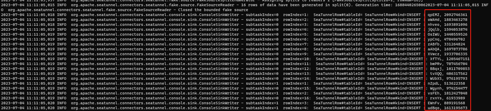
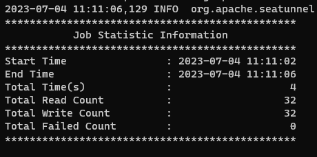

#### 部署
##### 第一步：准备环境
安装Java(Java 8 或者 11，8以上版本均可)，并设置JAVA_HOME

##### 第二步：下载Sea Tunnel
进入下载页（https://seatunnel.apache.org/download/），下载最新版本seatunnel-<version>-bin.tar.gz，详细说明请看主页。

> 快速下载，关注公众号：飞桨PPDB，回复st,获取百度网盘下载链接。

或者直接通过在终端中执行命令，以2.3.2版本为例，其它版本文件命名可能略有差异，请自行调整：
```sh
export version="2.3.2"
wget "https://dlcdn.apache.org/seatunnel/${version}/apache-seatunnel-${version}-bin.tar.gz"
tar -xzvf "apache-seatunnel-${version}-bin.tar.gz"
```

##### 第三步：安装连接器插件
进入安装根目录，执行
```sh
sh bin/install-plugin.sh
```
也可以指定版本，如2.3.0-beta
```sh
sh bin/install-plugin.sh 2.3.0-beta
```

通常我们并不需要所有的插件，这时我们可以修改`config/plugin_config`文件，例如我们只需要`connector-console`插件，我们修改为：
```sh
--connectors-v2--
connector-console
--end--
```
>经验分享，默认`plugin_config`文件中罗列了Sea Tunnel支持的全部连接器，安装过程会非常的漫长。建议在安装前中复制一个文件，然后在plugin_config中只保留需要的。

如果想要跑通示例的话，需要改为：
```sh
--connectors-v2--
connector-fake
connector-console
--end--
```
默认会安装所有插件，建议按需添加。
##### 第四步：用Config文件定义一个任务
配置`config/v2.batch.config.template`，此处需要说明，再执行任务时可以指定配置文件，所以配置文件目录和命名没有要求:
```sh
env {
  execution.parallelism = 1
  job.mode = "BATCH"
}

source {
  FakeSource {
    result_table_name = "fake"
    row.num = 16
    schema = {
      fields {
        name = "string"
        age = "int"
      }
    }
  }
}

transform {
  FieldMapper {
    source_table_name = "fake"
    result_table_name = "fake1"
    field_mapper = {
      age = age
      name = new_name
    }
  }
}

sink {
  Console {
    source_table_name = "fake1"
  }
}
```
关于配置文件中的各项参数，会在后续介绍中逐一说明。

##### 第五步：运行SeaTunnel应用
```sh
cd "apache-seatunnel-${version}"
./bin/seatunnel.sh --config ./config/v2.batch.config.template -e local
```
日志输出如下，红框内即为输出到控制台的`name`和`age`。需要理解的是，此处输出的`name`和`age`是根据指定的数据类型`string`和`int`模拟出来的数据，此处不必考虑实际意义。



为了了解任务执行情况，还可以在控制台找到相关信息



从上图可以快速了解到，本次执行从Source读取32条数据，输出到控制台也是32条数据。
> NOTE在实际使用过程中，看日志是不可缺少，熟练看懂日志可以帮助我们快速排查问题并得到解决，关于日志的详细讲解可以关注后续介绍。


关注我，带你深入了解SeaTunnel技术及应用。
